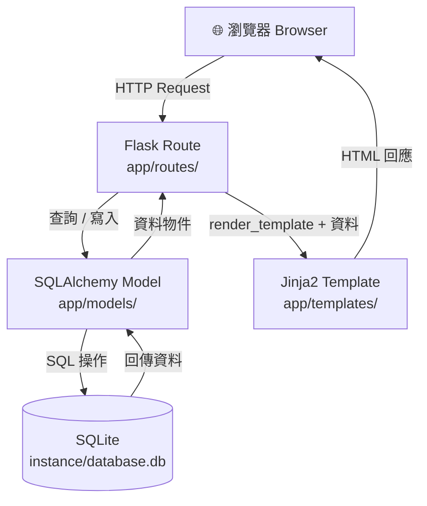

# 📐 讀書筆記本系統 — 系統架構文件（ARCHITECTURE）

**版本**：v1.0  
**建立日期**：2026-04-25  
**作者**：Alice  
**狀態**：草稿  

---

## 1. 技術架構說明

### 1.1 選用技術與原因

| 層級 | 技術 | 選用原因 |
|------|------|----------|
| **後端框架** | Python + Flask | 輕量、易學，適合單人本地應用；路由設計直覺簡潔 |
| **模板引擎** | Jinja2 | Flask 內建，與 Python 語法相近，易於傳遞資料至 HTML |
| **資料庫** | SQLite + SQLAlchemy ORM | 零配置、無需獨立伺服器；SQLAlchemy 提供安全的 ORM 操作，防止 SQL Injection |
| **前端** | HTML5 + Vanilla CSS + JavaScript | 不引入額外框架，保持輕量；JavaScript 處理即時搜尋與 Chart.js 圖表 |
| **圖表** | Chart.js | CDN 引入方便，API 易用，支援折線圖與圓餅圖 |
| **部署環境** | 本地端（localhost） | 個人單機使用，無需雲端部署 |

### 1.2 Flask MVC 模式說明

本專案採用 **MVC（Model / View / Controller）** 架構，各層職責如下：

| 角色 | 對應技術 | 職責 |
|------|----------|------|
| **Model（模型）** | `app/models/` + SQLAlchemy | 定義資料表結構、處理資料庫的 CRUD 操作 |
| **View（視圖）** | `app/templates/` Jinja2 HTML | 負責呈現頁面給使用者，由 Flask 傳入資料後渲染 |
| **Controller（控制器）** | `app/routes/` Flask Blueprint | 接收使用者請求、呼叫 Model 取得資料、選擇對應 View 回傳 |

---

## 2. 專案資料夾結構

```
reading-notebook/
│
├── app/                          ← 主應用程式套件
│   ├── __init__.py               ← 建立 Flask app、初始化 SQLAlchemy、註冊 Blueprint
│   │
│   ├── models/                   ← 資料庫模型（Model 層）
│   │   ├── __init__.py
│   │   ├── book.py               ← Book 資料表模型
│   │   └── tag.py                ← Tag 與 BookTag 資料表模型
│   │
│   ├── routes/                   ← Flask 路由／控制器（Controller 層）
│   │   ├── __init__.py
│   │   ├── books.py              ← 書籍 CRUD 路由（新增、列表、詳細、編輯、刪除）
│   │   ├── search.py             ← 搜尋與篩選路由
│   │   ├── dashboard.py          ← 統計儀表板路由
│   │   ├── quotes.py             ← 金句收藏庫路由
│   │   ├── tags.py               ← 標籤管理路由
│   │   └── export.py             ← 資料匯出路由（CSV / JSON）
│   │
│   ├── templates/                ← Jinja2 HTML 模板（View 層）
│   │   ├── base.html             ← 共用基礎模板（導航列、側邊欄、CSS 載入）
│   │   ├── books/
│   │   │   ├── list.html         ← 書籍清單頁
│   │   │   ├── detail.html       ← 書籍詳細頁
│   │   │   ├── create.html       ← 新增書籍表單頁
│   │   │   └── edit.html         ← 編輯書籍表單頁
│   │   ├── search/
│   │   │   └── index.html        ← 搜尋與篩選頁
│   │   ├── dashboard/
│   │   │   └── index.html        ← 統計儀表板頁
│   │   ├── quotes/
│   │   │   └── index.html        ← 金句收藏庫頁
│   │   └── tags/
│   │       └── index.html        ← 標籤管理頁
│   │
│   └── static/                   ← 靜態資源
│       ├── css/
│       │   └── style.css         ← 全域樣式（Dark Mode 主題、卡片、動畫）
│       └── js/
│           ├── search.js         ← 即時搜尋邏輯
│           ├── dashboard.js      ← Chart.js 圖表初始化
│           └── ui.js             ← 通用 UI 互動（Toast、確認對話框、複製金句）
│
├── instance/
│   └── database.db               ← SQLite 資料庫檔案（git 忽略）
│
├── app.py                        ← 應用程式入口（啟動 Flask dev server）
├── config.py                     ← 設定檔（資料庫路徑、Debug 模式等）
├── requirements.txt              ← Python 套件清單
└── .gitignore                    ← 忽略 instance/、__pycache__/ 等
```

---

## 3. 元件關係圖

### 3.1 請求與回應流程



### 3.2 各功能模組關係

```
┌─────────────────────────────────────────────────────────┐
│                      Flask Application                   │
│                                                         │
│  ┌──────────┐  ┌──────────┐  ┌──────────┐  ┌────────┐ │
│  │  books   │  │  search  │  │dashboard │  │ quotes │ │
│  │ Blueprint│  │ Blueprint│  │Blueprint │  │Blueprint│ │
│  └────┬─────┘  └────┬─────┘  └────┬─────┘  └───┬────┘ │
│       │              │              │             │      │
│  ┌────▼──────────────▼──────────────▼─────────────▼───┐ │
│  │              SQLAlchemy ORM (Models)                │ │
│  │         Book  ←──→  BookTag  ←──→  Tag             │ │
│  └─────────────────────────┬───────────────────────────┘ │
│                            │                             │
└────────────────────────────┼─────────────────────────────┘
                             ▼
                    ┌────────────────┐
                    │  SQLite DB     │
                    │ database.db    │
                    └────────────────┘
```

### 3.3 靜態資源載入關係

```
base.html
  ├── style.css        ← 所有頁面共用樣式
  ├── (條件載入) dashboard.js  ← 僅統計頁面載入
  ├── (條件載入) search.js     ← 僅搜尋頁面載入
  └── ui.js            ← 所有頁面共用互動邏輯
```

---

## 4. 關鍵設計決策

### 決策 1：使用 Flask Blueprint 模組化路由

**選擇**：每個功能模組（books、search、dashboard 等）使用獨立的 Blueprint。  
**原因**：避免所有路由寫在同一個檔案造成混亂；Blueprint 讓每個功能獨立維護，未來新增或移除功能時只需修改對應模組。

---

### 決策 2：SQLAlchemy ORM 而非直接使用 sqlite3

**選擇**：使用 SQLAlchemy 操作資料庫，而非原生 `sqlite3` 模組。  
**原因**：
- ORM 自動防止 SQL Injection 攻擊
- Python 物件操作比手寫 SQL 更直覺，降低出錯機率
- 若未來有需要，可輕易切換至 PostgreSQL 等資料庫

---

### 決策 3：Jinja2 服務端渲染，不採前後端分離

**選擇**：所有頁面由 Flask + Jinja2 在伺服器端渲染 HTML。  
**原因**：
- 專案規模小，不需要 React/Vue 等前端框架的複雜度
- 無需處理 API 跨域（CORS）問題
- 適合初學者理解完整的 Web 請求流程

---

### 決策 4：即時搜尋採用前端 JavaScript，統計查詢採用後端

**選擇**：即時搜尋透過 JavaScript 呼叫後端搜尋 API（`/search?q=`），統計儀表板資料在 Flask 路由中計算完畢後傳給模板。  
**原因**：
- 即時搜尋需要快速回應，前端觸發 AJAX 請求避免整頁重載
- 統計計算涉及複雜聚合查詢，交由後端（SQLAlchemy + SQL）處理更安全高效

---

### 決策 5：靜態資源集中管理，CSS 採 Dark Mode 優先

**選擇**：所有樣式統一寫在 `style.css`，以 CSS 自訂變數（CSS Variables）定義主題色彩，預設啟用深色模式。  
**原因**：
- CSS Variables 讓色彩管理集中，修改主題只需調整變數值
- 深色模式（`--bg-primary: #0f1117`、`--accent: #f59e0b`）符合 PRD 設計規格（深藍/深灰底、金色強調）

---

## 5. 資料流說明（以新增書籍為例）

```
1. 使用者填寫表單 → 點擊「儲存」
        ↓
2. 瀏覽器送出 POST /books/create
        ↓
3. books.py Blueprint 接收請求
   → 驗證表單資料（必填欄位檢查）
        ↓
4. 呼叫 Book Model → SQLAlchemy 建立新資料列
   → INSERT INTO books (...)
        ↓
5. 資料寫入 instance/database.db
        ↓
6. 302 Redirect → GET /books/<new_id>
        ↓
7. 查詢該筆記 → render_template('books/detail.html', book=book)
        ↓
8. 瀏覽器收到 HTML → 顯示詳細頁面 + Toast 通知
```

---

## 6. 環境設定與啟動方式

```bash
# 1. 安裝套件
pip install -r requirements.txt

# 2. 初始化資料庫
flask db init  # 或執行自訂的 init_db.py

# 3. 啟動開發伺服器
python app.py
# → 開啟瀏覽器至 http://localhost:5000
```

---

*本文件為 v1.0 草稿，如有修改請更新版本號與日期。*
