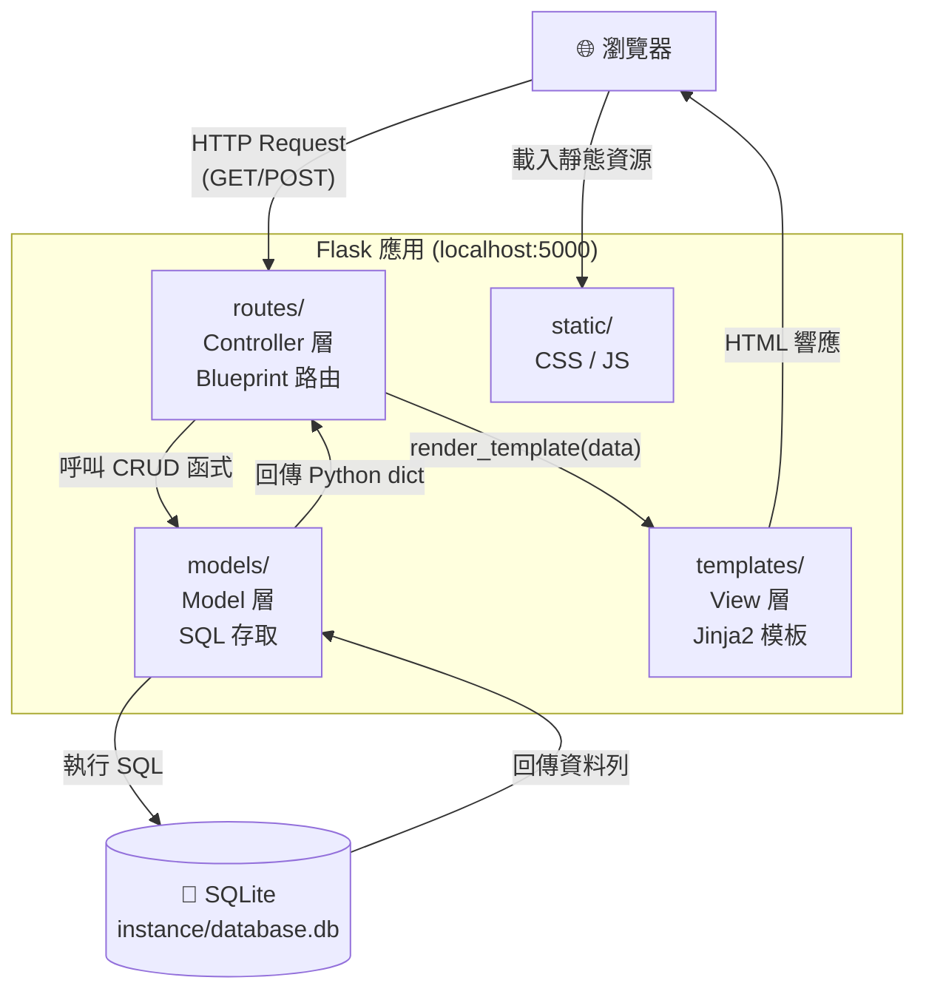
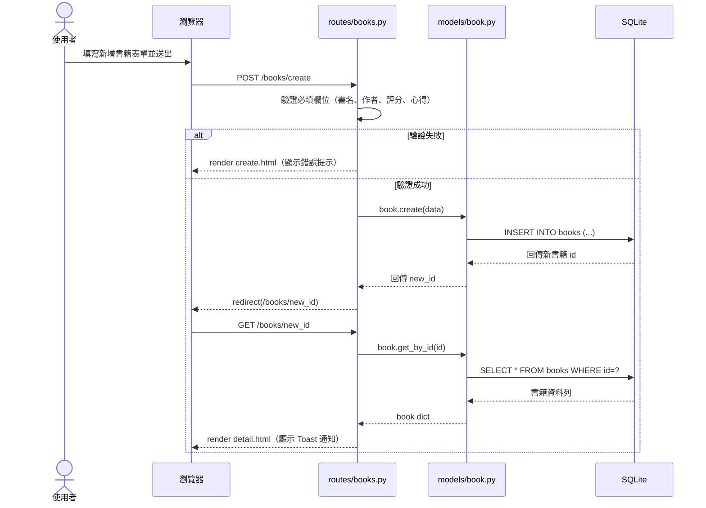
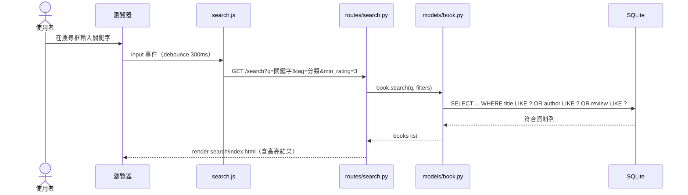

# 🏗️ 讀書筆記本系統 — 系統架構文件（ARCHITECTURE）

**版本**：v1.0  
**建立日期**：2026-04-25  
**作者**：Alice  
**參考文件**：`docs/PRD.md`  

---

## 1. 技術架構說明

### 1.1 選用技術與原因

| 技術 | 版本建議 | 選用原因 |
|------|----------|----------|
| **Python** | 3.10+ | 語法簡潔，生態豐富，適合快速開發個人工具 |
| **Flask** | 3.x | 輕量級 Web 框架，無複雜配置，適合中小型專案 |
| **Jinja2** | 隨 Flask 附帶 | Flask 內建模板引擎，與 Python 語法高度整合 |
| **SQLite** | 3.x | 零設定、單檔案資料庫，適合本地端個人應用 |
| **sqlite3** | Python 標準庫 | 無需額外安裝，直接操作 SQLite |
| **Chart.js** | 4.x (CDN) | 輕量圖表庫，透過 CDN 引用不需安裝 |
| **Vanilla CSS** | — | 直接控制樣式，不依賴框架，適合客製化設計 |

### 1.2 Flask MVC 模式說明

本系統採用 **MVC（Model-View-Controller）** 架構組織程式碼：

```
┌────────────────────────────────────────────────────────┐
│                      MVC 職責分工                       │
├──────────────┬─────────────────────────────────────────┤
│    Model     │  負責與資料庫溝通                         │
│  (models/)   │  • 執行 SQL 查詢（新增/查詢/更新/刪除）   │
│              │  • 封裝資料存取邏輯，讓路由不直接碰 SQL   │
├──────────────┼─────────────────────────────────────────┤
│     View     │  負責呈現 HTML 頁面                       │
│ (templates/) │  • Jinja2 模板，動態插入 Python 資料      │
│              │  • 只管顯示，不含商業邏輯                 │
├──────────────┼─────────────────────────────────────────┤
│  Controller  │  負責接收請求、協調 Model 與 View          │
│   (routes/)  │  • 處理 HTTP 路由（GET/POST）             │
│              │  • 輸入驗證、呼叫 Model、選擇渲染哪個模板 │
└──────────────┴─────────────────────────────────────────┘
```

---

## 2. 專案資料夾結構

```
reading_notebook/                  ← 專案根目錄
│
├── app/                           ← 主要應用程式套件
│   ├── __init__.py                ← Flask app 初始化、Blueprint 註冊
│   │
│   ├── models/                    ← Model 層（資料庫存取）
│   │   ├── __init__.py
│   │   ├── db.py                  ← 資料庫連線函式（get_db_connection）
│   │   ├── book.py                ← Book 相關 CRUD 函式
│   │   └── tag.py                 ← Tag 相關 CRUD 函式
│   │
│   ├── routes/                    ← Controller 層（Flask 路由）
│   │   ├── __init__.py
│   │   ├── books.py               ← 書籍 CRUD 路由（Blueprint: books）
│   │   ├── search.py              ← 搜尋與篩選路由（Blueprint: search）
│   │   ├── stats.py               ← 統計儀表板路由（Blueprint: stats）
│   │   ├── tags.py                ← 標籤管理路由（Blueprint: tags）
│   │   ├── quotes.py              ← 金句收藏路由（Blueprint: quotes）
│   │   └── export.py              ← 資料匯出路由（Blueprint: export）
│   │
│   ├── templates/                 ← View 層（Jinja2 HTML 模板）
│   │   ├── base.html              ← 基礎模板（導覽列、共用 head）
│   │   ├── books/
│   │   │   ├── index.html         ← 書籍清單頁
│   │   │   ├── detail.html        ← 書籍詳細頁
│   │   │   ├── create.html        ← 新增書籍頁
│   │   │   └── edit.html          ← 編輯書籍頁
│   │   ├── search/
│   │   │   └── index.html         ← 搜尋結果頁
│   │   ├── stats/
│   │   │   └── dashboard.html     ← 統計儀表板頁
│   │   ├── tags/
│   │   │   └── index.html         ← 標籤管理頁
│   │   ├── quotes/
│   │   │   └── index.html         ← 金句收藏頁
│   │   └── errors/
│   │       ├── 404.html           ← 404 錯誤頁
│   │       └── 500.html           ← 500 錯誤頁
│   │
│   └── static/                    ← 靜態資源
│       ├── css/
│       │   └── style.css          ← 全站樣式（深色主題）
│       └── js/
│           ├── main.js            ← 通用互動邏輯（Toast、確認對話框）
│           ├── search.js          ← 即時搜尋功能
│           └── charts.js          ← Chart.js 圖表初始化
│
├── instance/                      ← 執行期資料（不進 Git）
│   └── database.db                ← SQLite 資料庫檔案
│
├── database/
│   └── schema.sql                 ← 資料庫建表 SQL（初始化用）
│
├── docs/                          ← 文件目錄
│   ├── PRD.md                     ← 產品需求文件
│   ├── ARCHITECTURE.md            ← 本文件
│   └── ...（後續流程圖、DB 設計等）
│
├── app.py                         ← 應用程式入口點
├── requirements.txt               ← Python 套件清單
├── .env.example                   ← 環境變數範例（不含機密）
├── .gitignore                     ← 忽略 instance/、.venv/ 等
└── README.md                      ← 專案說明
```

---

## 3. 元件關係圖

### 3.1 整體架構圖



### 3.2 新增書籍請求流程



### 3.3 搜尋請求流程



---

## 4. 資料庫 Schema

```sql
-- 書籍筆記主表
CREATE TABLE books (
    id           INTEGER  PRIMARY KEY AUTOINCREMENT,
    title        TEXT     NOT NULL,
    author       TEXT     NOT NULL,
    finished_at  DATE     NOT NULL,
    rating       REAL     NOT NULL CHECK(rating BETWEEN 1 AND 5),
    review       TEXT     NOT NULL,
    cover_url    TEXT,
    is_recommend BOOLEAN  DEFAULT FALSE,
    quote        TEXT,
    created_at   DATETIME DEFAULT CURRENT_TIMESTAMP,
    updated_at   DATETIME DEFAULT CURRENT_TIMESTAMP
);

-- 標籤表
CREATE TABLE tags (
    id   INTEGER PRIMARY KEY AUTOINCREMENT,
    name TEXT    NOT NULL UNIQUE
);

-- 書籍與標籤多對多關聯表
CREATE TABLE book_tags (
    book_id INTEGER NOT NULL REFERENCES books(id) ON DELETE CASCADE,
    tag_id  INTEGER NOT NULL REFERENCES tags(id)  ON DELETE CASCADE,
    PRIMARY KEY (book_id, tag_id)
);

-- 預設標籤種子資料
INSERT INTO tags (name) VALUES
    ('科技'), ('文學'), ('心理學'), ('商業'), ('歷史'), ('其他');
```

---

## 5. 路由總覽

| Blueprint | HTTP 方法 | URL 路徑 | 功能 | 模板 |
|-----------|-----------|----------|------|------|
| `books` | GET | `/` | 書籍清單（可排序） | `books/index.html` |
| `books` | GET | `/books/<id>` | 書籍詳細頁 | `books/detail.html` |
| `books` | GET | `/books/create` | 新增書籍表單 | `books/create.html` |
| `books` | POST | `/books/create` | 送出新增表單 | — redirect |
| `books` | GET | `/books/<id>/edit` | 編輯書籍表單 | `books/edit.html` |
| `books` | POST | `/books/<id>/edit` | 送出編輯表單 | — redirect |
| `books` | POST | `/books/<id>/delete` | 刪除書籍 | — redirect |
| `search` | GET | `/search` | 搜尋結果頁 | `search/index.html` |
| `stats` | GET | `/stats` | 統計儀表板 | `stats/dashboard.html` |
| `stats` | GET | `/stats/api` | 統計 JSON API（供 Chart.js 使用） | — JSON |
| `tags` | GET | `/tags` | 標籤管理頁 | `tags/index.html` |
| `tags` | POST | `/tags/create` | 新增標籤 | — redirect |
| `tags` | POST | `/tags/<id>/delete` | 刪除標籤 | — redirect |
| `quotes` | GET | `/quotes` | 金句收藏頁 | `quotes/index.html` |
| `export` | GET | `/export/csv` | 匯出 CSV 檔案 | — file download |
| `export` | GET | `/export/json` | 匯出 JSON 檔案 | — file download |

---

## 6. 關鍵設計決策

### 決策 1：不使用 SQLAlchemy，直接用 sqlite3

**原因**：
- 本專案資料結構固定，不需要 ORM 的物件映射功能
- `sqlite3` 是 Python 標準庫，零依賴、輕量
- 直接寫 SQL 更直觀，有助於學習資料庫操作

**取捨**：不如 SQLAlchemy 易於遷移至其他資料庫，但對本地個人應用無影響。

---

### 決策 2：使用 Flask Blueprint 模組化路由

**原因**：
- 避免所有路由寫在單一 `app.py` 造成難以維護
- 每個功能模組（書籍、搜尋、統計、標籤、金句、匯出）各自獨立
- 日後新增功能只需新增 Blueprint，不影響現有程式碼

---

### 決策 3：搜尋使用 SQL LIKE，不引入全文搜尋引擎

**原因**：
- 個人使用書籍數量預計不超過 500 本，SQL LIKE 效能足夠
- 無需安裝 Elasticsearch 等額外服務
- 簡化維護複雜度

**取捨**：不支援模糊拼字搜尋，日後若需要可改用 SQLite FTS5 擴充。

---

### 決策 4：統計圖表使用 Chart.js CDN + JSON API

**原因**：
- 統計頁圖表需要 JavaScript 動態渲染，純 Jinja2 無法達成
- 將統計計算邏輯放在後端 `/stats/api` 回傳 JSON，前端 `charts.js` 負責渲染
- CDN 引用免安裝，版本升級只需修改 URL

---

### 決策 5：`instance/` 目錄存放資料庫，加入 .gitignore

**原因**：
- Flask 標準慣例，`instance/` 存放執行期資料（不 commit 進 Git）
- 避免個人讀書資料被推送到 GitHub
- `database/schema.sql` 提交進 Git，讓任何人都可重建資料庫結構

---

## 7. 環境設定

### requirements.txt

```
flask>=3.0.0
python-dotenv>=1.0.0
```

### .env.example

```env
# Flask 設定
FLASK_ENV=development
FLASK_DEBUG=1
SECRET_KEY=your-secret-key-here
```

### .gitignore 關鍵項目

```gitignore
instance/
.venv/
__pycache__/
*.pyc
.env
```

---

## 8. 啟動說明

```bash
# 1. 建立虛擬環境
python3 -m venv .venv
source .venv/bin/activate

# 2. 安裝套件
pip install -r requirements.txt

# 3. 初始化資料庫
python -c "from app import init_db; init_db()"

# 4. 啟動開發伺服器
flask run
# 開啟瀏覽器：http://localhost:5000
```

---

*本文件為 v1.0，依據 `docs/PRD.md v1.0` 產出。如 PRD 有修改，請同步更新本文件。*
