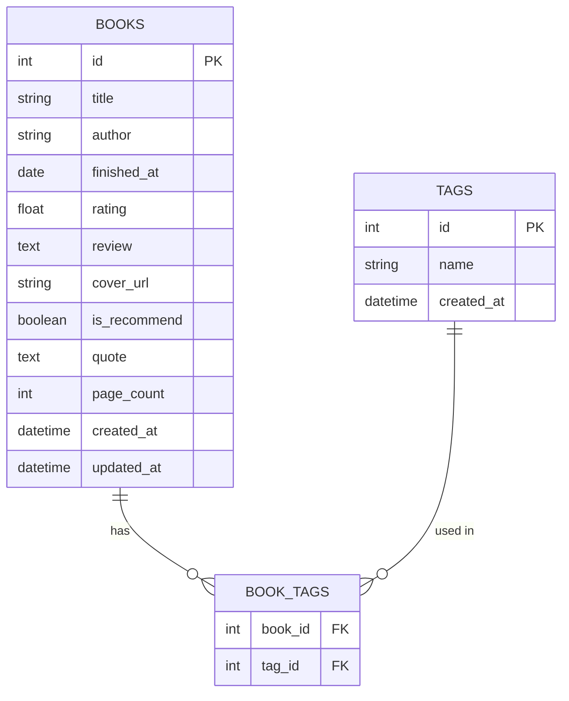

# 🗄️ 讀書筆記本系統 — 資料庫設計文件（DB_DESIGN）

**版本**：v1.0  
**建立日期**：2026-04-25  
**作者**：Alice  
**狀態**：草稿  

---

## 1. ER 圖（實體關係圖）

---

## 2. 資料表詳細說明

### 2.1 BOOKS（書籍筆記）

主要資料表，儲存每本書的基本資訊與個人讀後心得。

| 欄位 | 型別 | 必填 | 說明 |
|------|------|------|------|
| `id` | INTEGER | ✅ PK | 自動遞增主鍵 |
| `title` | TEXT | ✅ | 書籍完整名稱 |
| `author` | TEXT | ✅ | 作者姓名（多位作者以逗號分隔） |
| `finished_at` | DATE | ✅ | 實際閱讀完成日期（格式：YYYY-MM-DD） |
| `rating` | REAL | ✅ | 個人評分，1.0 ～ 5.0（支援半星，如 3.5） |
| `review` | TEXT | ✅ | 個人閱讀心得與重點摘要 |
| `cover_url` | TEXT | ❌ | 書籍封面圖片的外部 URL |
| `is_recommend` | BOOLEAN | ❌ | 是否公開推薦（預設 FALSE） |
| `quote` | TEXT | ❌ | 書中印象深刻的引用金句 |
| `page_count` | INTEGER | ❌ | 書籍總頁數（用於統計總閱讀頁數） |
| `created_at` | DATETIME | ✅ | 記錄建立時間（自動填入） |
| `updated_at` | DATETIME | ✅ | 記錄最後更新時間（自動填入） |

**約束條件**：
- `rating` 須在 1.0 ~ 5.0 之間（CHECK 約束）
- `title`、`author`、`review` 不可為空（NOT NULL）

---

### 2.2 TAGS（標籤）

儲存所有書籍分類標籤，包含系統預設標籤與使用者自訂標籤。

| 欄位 | 型別 | 必填 | 說明 |
|------|------|------|------|
| `id` | INTEGER | ✅ PK | 自動遞增主鍵 |
| `name` | TEXT | ✅ | 標籤名稱，全域唯一（UNIQUE） |
| `created_at` | DATETIME | ✅ | 標籤建立時間（自動填入） |

**預設標籤**（初始化時插入）：科技、文學、心理學、商業、歷史、其他

---

### 2.3 BOOK_TAGS（書籍標籤關聯）

多對多關聯表，連結 `books` 與 `tags`。

| 欄位 | 型別 | 必填 | 說明 |
|------|------|------|------|
| `book_id` | INTEGER | ✅ FK | 參照 `books.id`，書籍刪除時 CASCADE |
| `tag_id` | INTEGER | ✅ FK | 參照 `tags.id`，標籤刪除時 SET NULL（移除此關聯列） |

**複合主鍵**：`(book_id, tag_id)`，確保同一本書不重複掛相同標籤。

---

## 3. 資料表關聯說明

| 關聯 | 類型 | 說明 |
|------|------|------|
| `BOOKS` ↔ `TAGS` | 多對多（M:N） | 一本書可有多個標籤；一個標籤可套用在多本書 |
| `BOOK_TAGS.book_id` → `BOOKS.id` | ON DELETE CASCADE | 書籍刪除，對應的標籤關聯自動刪除 |
| `BOOK_TAGS.tag_id` → `TAGS.id` | ON DELETE CASCADE | 標籤刪除，對應的關聯列自動刪除，書籍本身不受影響 |

---

*本文件為 v1.0 草稿，如有修改請更新版本號與日期。*
