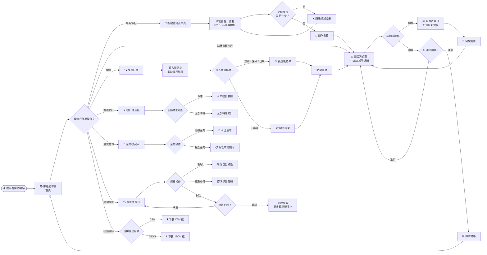
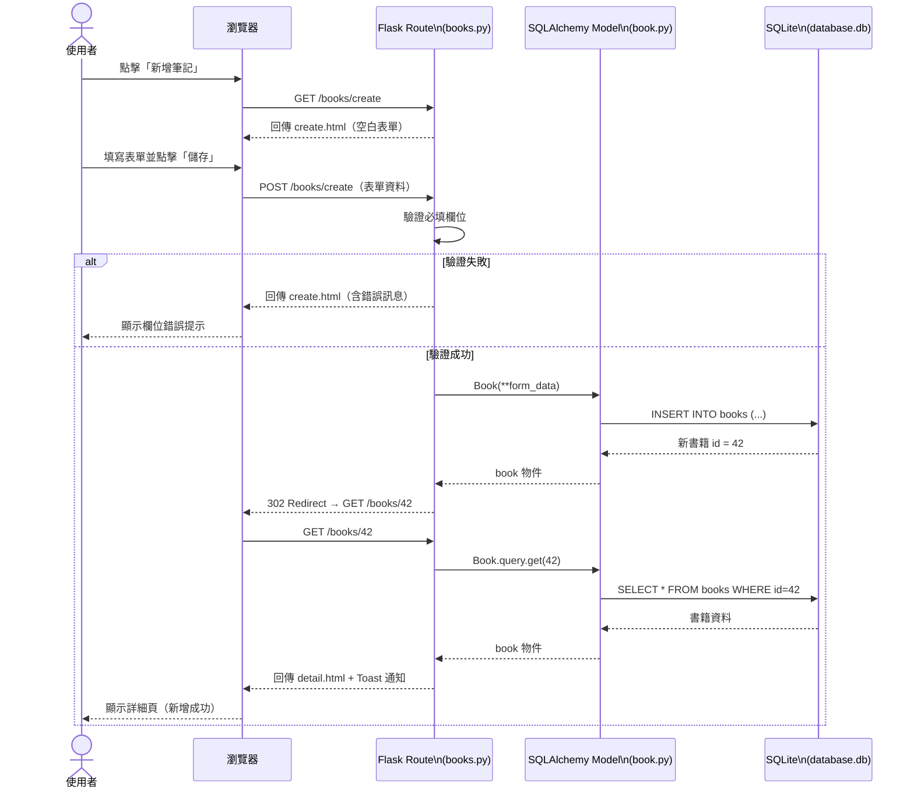
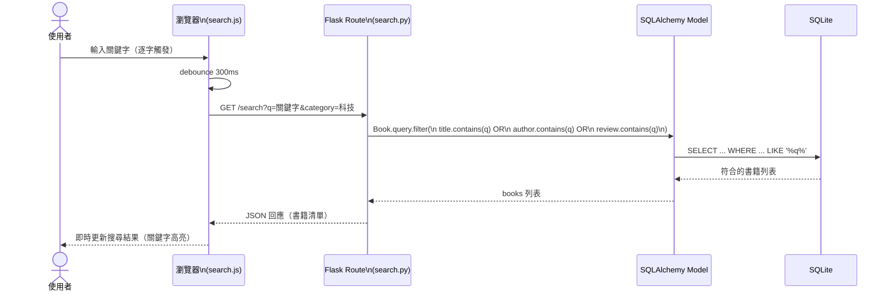
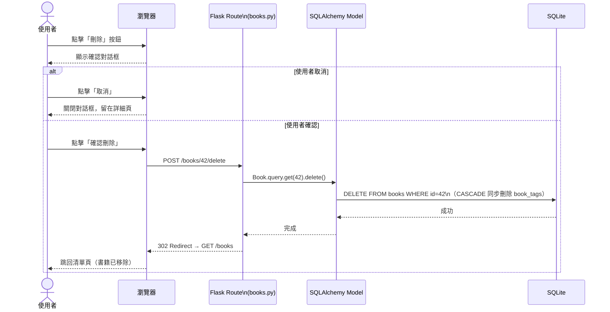
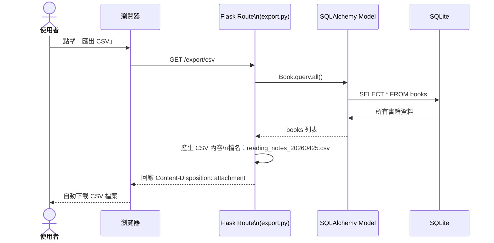

# 🗺️ 讀書筆記本系統 — 流程圖文件（FLOWCHART）

**版本**：v1.0  
**建立日期**：2026-04-25  
**作者**：Alice  
**狀態**：草稿  

---

## 1. 使用者流程圖（User Flow）

描述使用者從進入網站到完成各項操作的完整路徑。

---

## 2. 系統序列圖（Sequence Diagram）

### 2.1 新增書籍完整流程

---

### 2.2 即時搜尋流程

---

### 2.3 刪除書籍流程

---

### 2.4 匯出資料流程

---

## 3. 功能清單對照表

| 功能 | 頁面說明 | URL 路徑 | HTTP 方法 |
|------|----------|----------|-----------|
| 首頁 / 書籍清單 | 以卡片顯示所有書籍，支援排序 | `/` 或 `/books` | `GET` |
| 新增書籍表單頁 | 顯示空白表單 | `/books/create` | `GET` |
| 新增書籍（送出） | 接收表單資料，寫入資料庫 | `/books/create` | `POST` |
| 書籍詳細頁 | 顯示單筆完整書籍資料 | `/books/<id>` | `GET` |
| 編輯書籍表單頁 | 表單預填原始資料 | `/books/<id>/edit` | `GET` |
| 編輯書籍（送出） | 更新資料庫中的書籍資料 | `/books/<id>/edit` | `POST` |
| 刪除書籍 | 刪除書籍及其關聯標籤 | `/books/<id>/delete` | `POST` |
| 搜尋頁面 | 顯示搜尋與篩選介面 | `/search` | `GET` |
| 搜尋 API | 回傳符合條件的書籍（JSON） | `/search?q=&category=` | `GET` |
| 統計儀表板 | 顯示閱讀統計與圖表 | `/dashboard` | `GET` |
| 金句收藏庫 | 顯示所有金句卡片 | `/quotes` | `GET` |
| 隨機金句 API | 回傳一則隨機金句（JSON） | `/quotes/random` | `GET` |
| 標籤管理頁 | 列出所有標籤，可新增/刪除 | `/tags` | `GET` |
| 新增標籤 | 建立新標籤 | `/tags/create` | `POST` |
| 重新命名標籤 | 更新標籤名稱 | `/tags/<id>/edit` | `POST` |
| 刪除標籤 | 刪除標籤（書籍標籤欄清空） | `/tags/<id>/delete` | `POST` |
| 匯出 CSV | 下載所有書籍資料（CSV 格式） | `/export/csv` | `GET` |
| 匯出 JSON | 下載所有書籍資料（JSON 格式） | `/export/json` | `GET` |

---

*本文件為 v1.0 草稿，如有修改請更新版本號與日期。*
